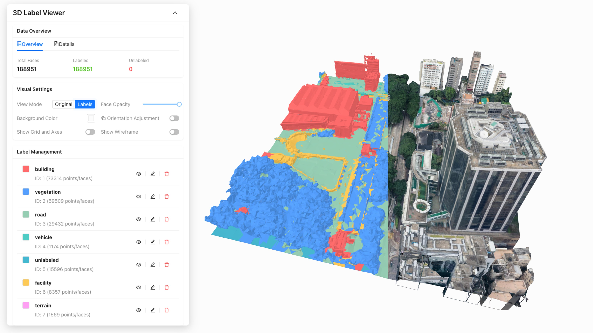

# GLB Label Viewer



## Overview

A **3D GLB mesh visualization tool** built with React + Three.js for viewing and exploring GLB/GLTF files with embedded labels and metadata. This tool provides an intuitive interface for 3D model inspection, label management, and interactive visualization. Visit by this [https://ni1o1.github.io/GLB_label_viewer](https://ni1o1.github.io/GLB_label_viewer).

## Features

This tool provides comprehensive GLB/GLTF file visualization with embedded label support, featuring interactive 3D viewing with smooth camera controls, mesh inspection capabilities, and PBR material rendering. It includes advanced compression support (Draco/KTX2), real-time rendering optimization, customizable visual controls (wireframe, lighting, backgrounds), and the ability to parse, display, and export custom metadata while maintaining a responsive design across different devices.


## Label Data Format

### GLB Annotation Structure

The annotation data is provided in the form of 3D Tiles in GLB format, where face label information is stored in the JSON structure of GLB files through the `extras` field of the GLTF specification. This design fully utilizes the extension mechanism of GLTF for storing structured face annotation information.

### Data Storage Mechanism

Specifically, the `extras` field of each `mesh` object contains two key components:

#### 1. Label Definitions (`labelDefinitions`)
A global list defining all label IDs, names, and metadata:

```json
{
  "extras": {
    "labelDefinitions": [
      {
        "id": 0,
        "name": "Ground",
        "color": [0.5, 0.3, 0.1],
        "metadata": {
          "category": "terrain",
          "description": "Ground surface"
        }
      },
      {
        "id": 1,
        "name": "Building",
        "color": [0.8, 0.2, 0.2],
        "metadata": {
          "category": "structure",
          "description": "Building facade"
        }
      }
    ]
  }
}
```

#### 2. Face Labels (`faceLabels`)
An integer array that strictly corresponds to the number of triangular faces in the mesh, with each element representing the label ID of the corresponding face:

```json
{
  "extras": {
    "faceLabels": [0, 0, 1, 1, 0, 2, 1, 0, ...]
  }
}
```

### Implementation Details

- **Face-Label Correspondence**: The `faceLabels` array length must exactly match the number of triangular faces in the mesh geometry
- **Label ID Mapping**: Each integer in `faceLabels` corresponds to an `id` in `labelDefinitions`
- **Hierarchical Structure**: Labels can include nested metadata for complex classification schemes
- **Color Coding**: Each label definition includes RGB color values for consistent visualization
- **Extensible Format**: Additional properties can be added to support domain-specific requirements

### Parsing and Visualization

The viewer automatically:
1. **Extracts** label definitions and face labels from GLB `extras` fields
2. **Validates** the correspondence between face count and label array length
3. **Applies** color coding to mesh faces based on label assignments
4. **Displays** label information in the interactive sidebar
5. **Enables** selective visualization and filtering by label categories


## Installation

```bash
# Clone the repository
git clone <repository-url>
cd GLB_label_viewer

# Install dependencies
npm install

# Start development server
npm run dev
```

## File Format Support

### GLB/GLTF Compatibility
- **Standard GLB**: Binary GLTF files with embedded assets
- **GLTF + Assets**: GLTF files with external textures and binaries
- **Draco Compression**: Compressed geometry for smaller file sizes
- **KTX2 Textures**: Compressed texture formats for better performance
- **Custom Extensions**: Support for application-specific metadata


## Contributing

Please feel free to submit issues and pull requests.

## License

This project is licensed under the MIT License.
